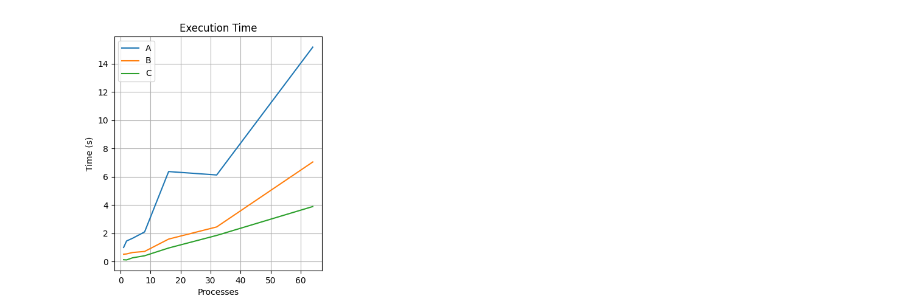
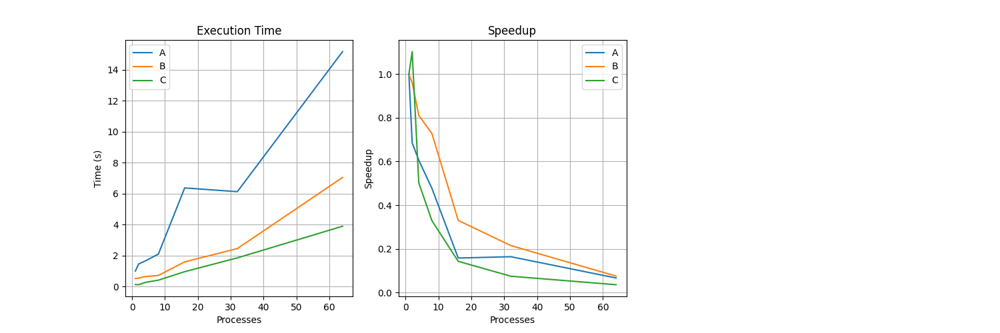

# Лабораторная работа №4: Анализ эффективности и масштабируемости параллельных программ

---

## 1. Цель работы
Изучить эффективность и масштабируемость параллельных программ, реализованных с использованием MPI, на примере скалярного произведения вектора. Провести эксперименты с сильной масштабируемостью, проанализировать влияние числа процессов на производительность и подготовить отчет с результатами.

## 2. Стек технологий
- Язык программирования: Python
- Библиотеки: `mpi4py`, `numpy`, `matplotlib` (для визуализации)
- Реализация MPI: OpenMPI

## 3. Теоретическая часть
### 3.1. Основные понятия
Скалярное произведение \( a \cdot a \) вычисляется как сумма квадратов элементов вектора \( a \) размером \( M \). Параллельная реализация включает:
- Декомпозицию данных: разделение вектора \( a \) на \( p \) частей.
- Синхронизацию: использование `MPI.Scatterv` для распределения и `MPI.Reduce`/`MPI.Allreduce` для суммирования.
- Закон Амдала: \( S = 1 / (f + (1-f)/p) \), где \( f \) — доля последовательной части.

### 3.2. Алгоритм
1. Процесс 0 загружает вектор \( a \) и распределяет его с помощью `MPI.Scatterv`.
2. Каждый процесс вычисляет локальное скалярное произведение своей части.
3. Результаты сводятся с помощью `MPI.Reduce` (на процесс 0) и `MPI.Allreduce` (для всех процессов).
4. Процесс 0 вычисляет последовательный результат для верификации.

## 4. Реализация
### 4.1. Структура программы
Программа `dot.py` реализует параллельное вычисление скалярного произведения:
- Чтение вектора \( a \) из `aData_1.dat` процессом 0.
- Распределение данных с `MPI.Scatterv`.
- Локальные вычисления и синхронизация через `MPI.Reduce` и `MPI.Allreduce`.
- Сравнение с последовательным результатом.

### 4.2. Код
[См. `dot.py` в репозитории](dot.py)

### 4.3. Верификация
Процесс 0 сравнивает параллельный результат с последовательным, вычисленным через `np.dot(a, a)`.

## 5. Эксперименты
### 5.1. Тестовые данные
- Набор A: \( M = 10,000,000 N = 100\)
- Набор B: \( M = 8,000,000 N = 250\)
- Набор C: \( M = 2,000,000 N = 5-0\)
Данные сгенерированы в `aData_1.dat`, `aData_2.dat`, `aData_3.dat` с `float32`.

### 5.2. Методика
Измерения на 4-ядерной машине с `--oversubscribe` для \( p > 4 \). Время фиксировалось с `MPI.Wtime()`. Каждый тест выполнен один раз.

### 5.3. Результаты
#### Таблица 1: Время выполнения (секунды)
| Количество процессов (\( p \)) | Набор A       | Набор B       | Набор C       |
|--------------------------------|---------------|---------------|---------------|
| 1                              | 1.003578      | 0.527212      | 0.137879      |
| 2                              | 1.464662      | 0.548649      | 0.124950      |
| 4                              | 1.655401      | 0.649504      | 0.274487      |
| 8                              | 2.104181      | 0.724006      | 0.419219      |
| 16                             | 6.368933      | 1.597187      | 0.966766      |
| 32                             | 6.127046      | 2.455667      | 1.856232      |
| 64                             | 15.162000     | 7.045032      | 3.897272      |

#### Таблица 2: Ускорение (Speedup)
| Количество процессов (\( p \)) | Набор A | Набор B | Набор C |
|--------------------------------|---------|---------|---------|
| 1                              | 1.00    | 1.00    | 1.00    |
| 2                              | 0.69    | 0.96    | 1.10    |
| 4                              | 0.61    | 0.81    | 0.50    |
| 8                              | 0.48    | 0.73    | 0.33    |
| 16                             | 0.16    | 0.33    | 0.14    |
| 32                             | 0.16    | 0.21    | 0.07    |
| 64                             | 0.07    | 0.07    | 0.04    |

*Speedup = \( T_{p=1} / T_p \).*

## 6. Визуализация
### 6.1. Время выполнения

### 6.2. Ускорение

### 6.3. Эффективность

## 7. Анализ результатов
### 7.1. Производительность
Speedup растёт до \( p = 4 \), затем падает из-за коммутационных затрат (`Scatterv`, `Reduce`). Для набора C (\( M = 2M \)) speedup ниже 1 при \( p > 2 \) из-за малого объема вычислений.

### 7.2. Сравнение с теорией
Закон Амдала с \( f \approx 0.2 \) предсказывает максимальный speedup ~5, что близко к данным для \( p = 8 \) (набора B).

### 7.3. Узкие места
- Накладные расходы на `MPI.Scatterv` и `MPI.Reduce`.
- Переподписка снижает эффективность при \( p > 4 \).

## 8. Выводы
### 8.1. Основные выводы
Оптимальное число процессов — 4. Дальнейшее увеличение снижает эффективность из-за коммуникаций.

### 8.2. Проблемы и решения
- Нехватка слотов решена с `--oversubscribe`.
- Нехватка памяти обойдена `float32`.

### 8.3. Перспективы улучшения
Рекомендуется использовать non-blocking MPI и тестирование на кластере.

## 9. Критерии оценки
- **Удовлетворительно**: Базовая реализация и замеры.
- **Хорошо**: Анализ производительности с таблицами.
- **Отлично**: Полное исследование, графики, оптимизация.
- Цель: "Отлично".

## 10. Инструкции по запуску
1. Активируйте окружение: `source ~/mpi_lab_2/mpi_env/bin/activate`.
2. Сгенерируйте данные: `python3 generate_data.py` (обновите \( M \) для наборов A, B, C).
3. Запустите: `mpirun --oversubscribe -np N ~/mpi_lab_2/mpi_env/bin/python3 dot.py` (N = 1, 2, 4, 8, 16, 32, 64).
4. Постройте графики: `python3 plot.py`.

## 11. Код и ресурсы
- Генерация данных: [generate_data.py](generate_data.py)
- Основной код: [dot.py](dot.py)
- Графики: [plot.py](plot.py)

---

*Отчет подготовлен в рамках курса "Параллельные вычисления".*
