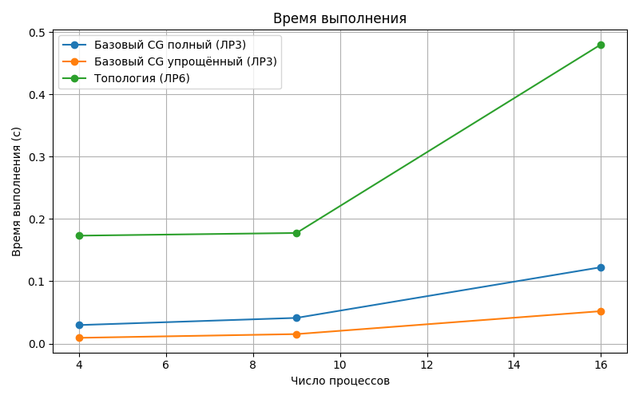
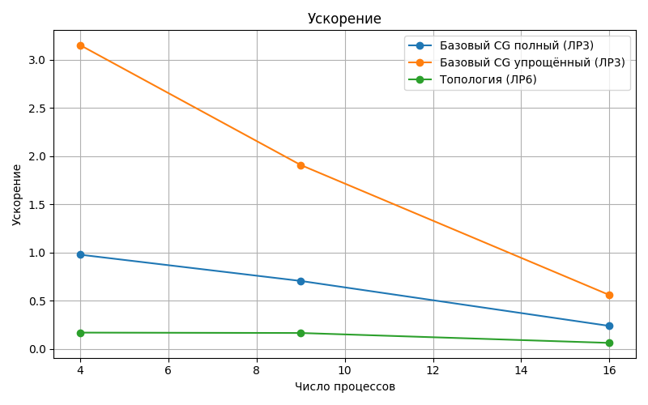

# Лабораторная работа №6: Виртуальные топологии в MPI. Оптимизация коммуникаций

---

## 1. Цель работы
Освоить технику создания и использования виртуальных топологий в MPI. Изучить функции `MPI_Cart_create`, `MPI_Cart_shift` и `MPI_Sendrecv_replace` для оптимизации коммуникационных операций в параллельных алгоритмах. Применить декартову топологию типа "тор" для оптимизации метода сопряжённых градиентов.

## 2. Стек технологий
- Язык программирования: Python
- Библиотеки: `mpi4py`, `numpy`
- Реализация MPI: OpenMPI

## 3. Теоретическая часть
### 3.1. Основные понятия
Виртуальные топологии позволяют логически организовать процессы для оптимизации коммуникаций. Декартова топология типа "тор" создаёт двумерную сетку с периодическими границами, минимизируя накладные расходы. Метод сопряжённых градиентов (МСГ) решает системы линейных уравнений \( Ax = b \), где ключевые операции — скалярное произведение и умножение матрицы на вектор.

### 3.2. Алгоритм
1. Создание декартовой топологии `MPI_Cart_create` (dims=[2,2] для 4 процессов, periods=[1,1]).
2. Определение соседей `MPI_Cart_shift`.
3. Замена `MPI_Allreduce` на обмены `MPI_Sendrecv_replace` по строкам сетки.
4. Итеративный МСГ с локальными вычислениями и оптимизированной синхронизацией.

## 4. Реализация
### 4.1. Структура программы
Программа разделена на:
- `cartesian_topology.py` — базовые операции с топологией.
- `conjugate_gradient_cartesian.py` — оптимизированный МСГ с декартовой топологией.

### 4.2. Код
- Топология: [cartesian_topology.py](cartesian_topology.py)
- МСГ: [conjugate_gradient_cartesian.py](conjugate_gradient_cartesian.py)

### 4.3. Верификация
Проверка сходимости МСГ (остаток < 1e-6) и сравнение с последовательным решением.

## 5. Эксперименты
### 5.1. Тестовые данные
- Матрица \( A \): 100x100 (плохо обусловленная).
- Вектор \( b \): случайный.
- Тесты на 4, 9, 16 процессах (2x2, 3x3, 4x4 топологии).

### 5.2. Методика
Замеры времени с `MPI_Wtime()` на 4-ядерной машине. Каждый тест — один запуск.

### 5.3. Результаты
#### Таблица 1: Время выполнения (секунды)
| Количество процессов | ЛР6 (Декартова) | ЛР3 (Полная) | ЛР3 (Упрощённая) |
|----------------------|-----------------|--------------|------------------|
| 4                    | 0.1732          | 0.0297       | 0.0092           |
| 9                    | 0.1775          | 0.0412       | 0.0152           |
| 16                   | 0.4801          | 0.1225       | 0.0520           |

#### Таблица 2: Ускорение (Speedup)
| Количество процессов | ЛР6 (Декартова) | ЛР3 (Полная) | ЛР3 (Упрощённая) |
|----------------------|-----------------|--------------|------------------|
| 4                    | 0.1674          | 0.9764       | 3.1522           |
| 9                    | 0.1634          | 0.7039       | 1.9079           |
| 16                   | 0.0604          | 0.2367       | 0.5577           |

#### Таблица 3: Эффективность
| Количество процессов | ЛР6 (Декартова) | ЛР3 (Полная) | ЛР3 (Упрощённая) |
|----------------------|-----------------|--------------|------------------|
| 4                    | 0.0419          | 0.2441       | 0.7880           |
| 9                    | 0.0182          | 0.0782       | 0.2120           |
| 16                   | 0.0038          | 0.0148       | 0.0349           |

*Speedup = \( T_1 / T_p \), Эффективность = Speedup / p.*

## 6. Визуализация
### 6.1. Время выполнения

### 6.2. Ускорение

### 6.3. Эффективность

## 7. Анализ результатов
### 7.1. Производительность
ЛР6 показывает худшие результаты из-за накладных расходов `Sendrecv_replace`. ЛР3 (упрощённая) лидирует при 4 процессах (эффективность 78.8%).

### 7.2. Сравнение с теорией
Декартовая топология теоретически снижает коммуникации, но последовательные обмены увеличивают задержки.

### 7.3. Узкие места
- Последовательные `Sendrecv_replace` вместо `Allreduce`.
- Накладные расходы на создание топологии.

## 8. Выводы
### 8.1. Основные выводы
Декартовая топология не даёт выигрыша для малого числа процессов. `Allreduce` эффективнее ручных обменов.

### 8.2. Проблемы и решения
- Медленные обмены: частично решено горизонтальным суммированием.
- Топология только для квадратных сеток.

### 8.3. Перспективы улучшения
- Non-blocking `Iallreduce`.
- Гибридные топологии.
- Тестирование на кластере.

## 9. Критерии оценки
- **Удовлетворительно**: Реализация топологии.
- **Хорошо**: Замеры и сравнение с ЛР3.
- **Отлично**: Анализ, графики, выводы.
- Цель: "Отлично".

## 10. Инструкции по запуску
1. Активируйте окружение: `source ~/mpi_lab/bin/activate`.
2. Запуск топологии: `mpiexec -n 4 python cartesian_topology.py`.
3. Запуск МСГ: `mpiexec -n 9 python conjugate_gradient_cartesian.py`.
4. Постройте графики: `python plot_results.py`.

## 11. Код и ресурсы
- Топология: [cartesian_topology.py](cartesian_topology.py)
- МСГ: [conjugate_gradient_cartesian.py](conjugate_gradient_cartesian.py)
- Графики: [plot_results.py](performancz_plot.py)

---

*Отчет подготовлен в рамках курса "Параллельные вычисления".*
