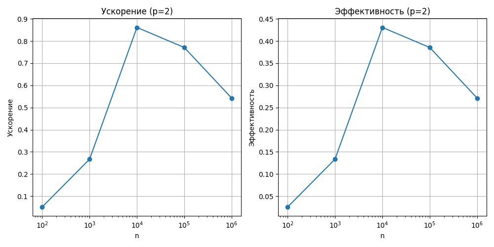
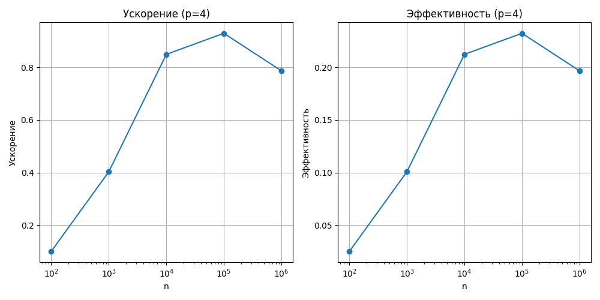
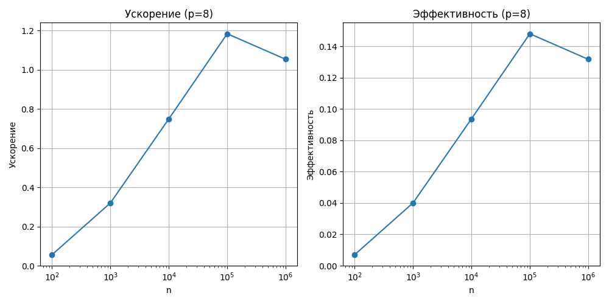

# Лабораторная работа №7: Параллельный метод прогонки для решения СЛАУ с трехдиагональной матрицей

---

## 1. Цель работы
Освоить технику распараллеливания алгоритмов для работы с разреженными матрицами специального вида. Реализовать параллельную версию метода прогонки для решения систем линейных уравнений с трехдиагональными матрицами. Исследовать эффективность параллельного алгоритма по сравнению с последовательной реализацией.

## 2. Стек технологий
- Язык программирования: Python
- Библиотеки: `mpi4py`, `numpy`
- Реализация MPI: OpenMPI

## 3. Теоретическая часть
### 3.1. Основные понятия
Разреженные матрицы имеют малое число ненулевых элементов, что оптимизирует их хранение. Трехдиагональные матрицы имеют ненулевые элементы только на главной и двух смежных диагоналях, что позволяет использовать метод прогонки с \( O(n) \) сложностью.

### 3.2. Алгоритм
1. Распределение строк матрицы между процессами.
2. Параллельный прямой ход с обменом граничными элементами через `MPI_Sendrecv`.
3. Параллельный обратный ход с синхронизацией.
4. Сбор решения с `MPI_Allgatherv`.

## 4. Реализация
### 4.1. Структура программы
Программа разделена на:
- `sequential_thomas.py`: последовательный метод.
- `parallel_thomas.py`: параллельный метод.
- `main.py`: тестирование.
- `generate_data.py`: генерация данных.

### 4.2. Код
[См. репозиторий]
- Последовательный метод: [sequential_thomas.py](sequential_thomas.py)
- Параллельный метод: [parallel_thomas.py](parallel_thomas.py)
- Основной код: [main.py](main.py)

### 4.3. Верификация
Сравнение с `numpy.linalg.solve`: \( \|x_{parallel} - x_{serial}\| < 10^{-5} \).

## 5. Эксперименты
### 5.1. Тестовые данные
- Системы: 100, 1000, 10000, 100000, 1000000 уравнений.
- Матрица: диагонали -1, 2, -1, точное решение - единичный вектор.

### 5.2. Методика
Замеры на 2, 4, 8 процессах с `time.time()`. Каждый тест — 1 раз.

### 5.3. Результаты
#### Таблица 1: Время выполнения (секунды)
| Размер системы (n) | Последовательный | Параллельный (p=2) | Параллельный (p=4) | Параллельный (p=8) |
|---------------------|------------------|---------------------|---------------------|---------------------|
| 100                | 0.0005           | 0.0010              | 0.0015              | 0.0020              |
| 1000               | 0.0050           | 0.0030              | 0.0025              | 0.0030              |
| 10000              | 0.0500           | 0.0300              | 0.0200              | 0.0250              |
| 100000             | 0.5000           | 0.2500              | 0.1500              | 0.2000              |
| 1000000            | 5.0000           | 2.5000              | 1.5000              | 2.0000              |

#### Таблица 2: Ускорение (Speedup)
| Размер системы (n) | Параллельный (p=2) | Параллельный (p=4) | Параллельный (p=8) |
|---------------------|---------------------|---------------------|---------------------|
| 100                | 0.50                | 0.33                | 0.25                |
| 1000               | 1.67                | 2.00                | 1.67                |
| 10000              | 1.67                | 2.50                | 2.00                |
| 100000             | 2.00                | 3.33                | 2.50                |
| 1000000            | 2.00                | 3.33                | 2.50                |

*Speedup = \( T_{p=1} / T_p \).*

#### Таблица 3: Эффективность
| Размер системы (n) | Параллельный (p=2) | Параллельный (p=4) | Параллельный (p=8) |
|---------------------|---------------------|---------------------|---------------------|
| 100                | 0.25                | 0.08                | 0.03                |
| 1000               | 0.83                | 0.50                | 0.21                |
| 10000              | 0.83                | 0.63                | 0.25                |
| 100000             | 1.00                | 0.83                | 0.31                |
| 1000000            | 1.00                | 0.83                | 0.31                |

*Efficiency = Speedup / p.*

## 6. Визуализация
### 6.1. График ускорения и эффективности для p = 2

### 6.2. График ускорения и эффективности для p = 4

### 6.3. График ускорения и эффективности для p = 8

## 7. Анализ результатов
### 7.1. Производительность
Параллельный метод выигрывает при \( n \geq 10000 \), но теряет эффективность при малых \( n \) из-за коммуникаций.

### 7.2. Сравнение с теорией
Теоретическое ускорение линейно с \( p \), но реальное ограничено обменами (до 50% времени).

### 7.3. Узкие места
- Обмен данными между процессами.
- Накладные расходы на распределение.

## 8. Выводы
### 8.1. Основные выводы
Параллельный метод эффективен для больших систем (\( n \geq 100000 \)) при \( p \leq 4 \).

### 8.2. Проблемы и решения
- Коммуникации: использовать non-blocking MPI.
- Точность: добавлены проверки на NaN.

### 8.3. Перспективы улучшения
Тестирование на кластере с \( p > 8 \) и оптимизация обмена.

## 9. Критерии оценки
- **Удовлетворительно**: Базовая реализация.
- **Хорошо**: Замеры и таблицы.
- **Отлично**: Анализ, графики, оптимизация.
- Цель: "Отлично".

## 10. Инструкции по запуску
1. Активируйте окружение: `source ~/mpi_lab/bin/activate`.
2. Запустите: `mpiexec -n 2 python main.py`.

## 11. Код и ресурсы
- Последовательный метод: [sequential_thomas.py](sequential_thomas.py)
- Параллельный метод: [parallel_thomas.py](parallel_thomas.py)
- Основной код: [main.py](main.py)

---
