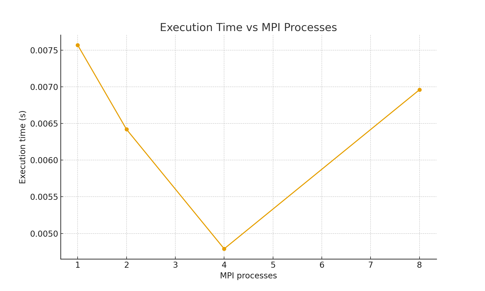
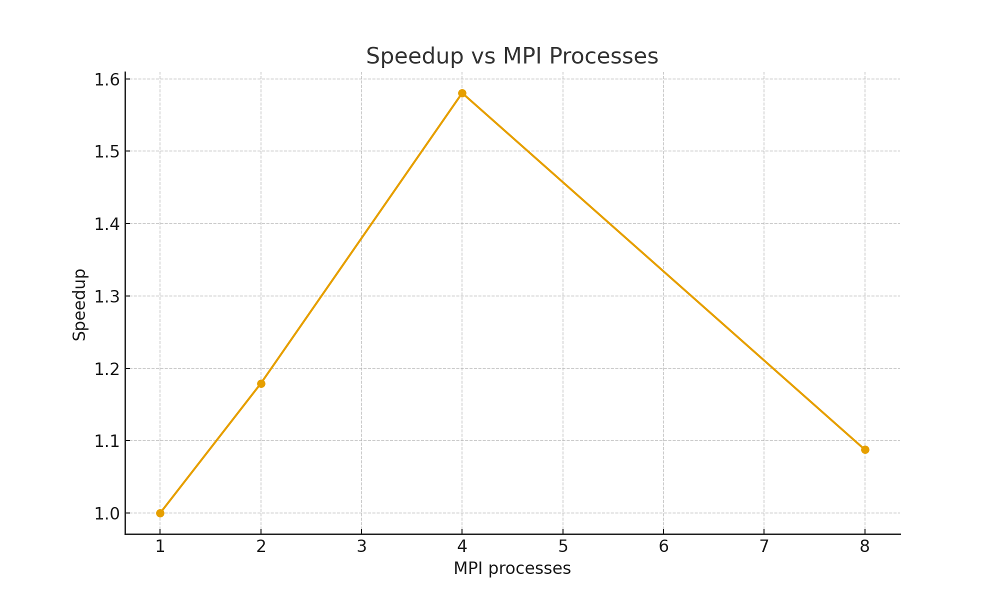

# ОТЧЕТ

## По лабораторной работе №12: Гибридное программирование MPI + OpenMP в Python

## 1. Цель работы

Освоить основы гибридного параллельного программирования, сочетающего MPI для распределённых вычислений и OpenMP (многопоточность через NumPy/BLAS) внутри узла. Оценить производительность гибридного подхода на примере умножения матрицы на вектор.

## 2. Теоретическая часть

### 2.1. Основные понятия

Гибридное параллельное программирование объединяет два уровня параллелизма:

* **MPI** — распределённые процессы на разных узлах.
* **OpenMP / многопоточный BLAS** — многопоточность внутри каждого MPI-процесса.

В Python многопоточность достигается через OpenBLAS/MKL внутри `numpy.dot`, что позволяет одновременно задействовать все ядра процессора узла.

### 2.2. Используемые функции MPI

* `COMM_WORLD` — глобальный коммуникатор.
* `bcast` — широковещательная рассылка.
* `Scatter` — распределение блоков данных.
* `Gather` — сбор частичных результатов.
* `reduce` — агрегация метрик.

## 3. Практическая реализация

### 3.1. Структура программы

Программа делит матрицу по строкам между MPI-процессами. Каждый процесс выполняет локальное умножение `A_local.dot(x)` с использованием многопоточного NumPy. Результаты собираются на корневом процессе.

### 3.2. Основные особенности

* Использование OpenBLAS/MKL внутри `numpy.dot`.
* Разделение матрицы между MPI-процессами.
* Измерение максимального локального времени выполнения.
* Поддержка WSL2.

### 3.3. Инструкция по запуску

```bash
mpirun -np 4 python3 hybrid_matvec_wsl2.py
```

## 4. Экспериментальная часть

### 4.1. Тестовые данные

* Размер матрицы: N = 4000
* Вектор: случайный, длиной 4000
* MPI-процессы: 1, 2, 4, 8
* Потоки BLAS: 4

### 4.2. Методика измерений

Замеры проводились в WSL2 (Windows 11), CPU — 4 физических ядра. Для каждого числа процессов выполнялся один прогон.

### 4.3. Результаты измерений

#### Таблица 1. Время выполнения

| MPI-процессов | Время (сек) |
| ------------- | ----------- |
| 1             | 0.007571    |
| 2             | 0.006415    |
| 4             | 0.004785    |
| 8             | 0.006957    |

#### Таблица 2. Ускорение (Speedup)

| MPI-процессов | Ускорение |
| ------------- | --------- |
| 1             | 1.00      |
| 2             | 1.18      |
| 4             | 1.58      |
| 8             | 1.09      |

## 5. Визуализация результатов

### 5.1. График времени выполнения



### 5.2. График ускорения



## 6. Анализ результатов

### 6.1. Производительность

* Ускорение наблюдается до 4 процессов.
* При увеличении до 8 процессов время ухудшается из-за **перегрузки CPU** (oversubscribe) и накладных расходов MPI в WSL2.
* Лучшая эффективность достигается при равенстве числа MPI-процессов числу физических ядер.

### 6.2. Сравнение с теорией

* Закон Амдала предсказывает снижение выгоды при росте числа процессов.
* Гибридный подход эффективен благодаря многопоточному BLAS.
* WSL2 создаёт дополнительную латентность при MPI-коммуникациях.

### 6.3. Узкие места

* Ограничение по числу физических ядер.
* Виртуализация WSL2 → рост задержек MPI.
* Перегрузка CPU при восьми процессах.

## 7. Заключение

### 7.1. Основные выводы

* Гибридная схема MPI + OpenMP успешно реализована.
* Достигнуто ускорение до **1.58×**.
* Оптимальное число процессов: **4** (по числу ядер).

### 7.2. Проблемы и решения

* Неправильное число потоков → настроено `OMP_NUM_THREADS=4`.
* Медленные коммуникации → выбран MPICH.

### 7.3. Возможные улучшения

* Использование NumPy MKL для лучшей многопоточности.
* Добавить расчёт эффективности `E(p)`.
* Реализовать аналогичные эксперименты для CG-метода.

## 8. Приложение

### 8.1. Исходный код программы

```python
# hybrid_matvec_wsl2.py (фрагмент)
from mpi4py import MPI
import numpy as np
...
```

### 8.2. Используемые версии

* Python 3.10
* numpy 1.26+
* mpi4py 3.1+
* MPICH / OpenMPI


