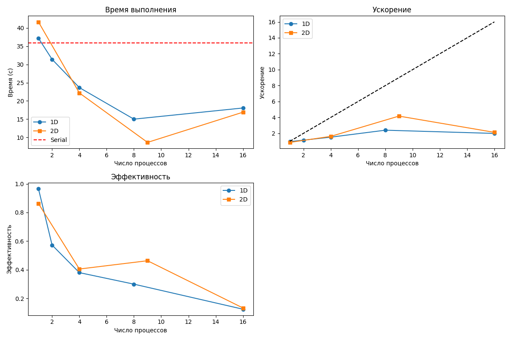

# Лабораторная работа №10: Параллелизация двумерного уравнения теплопроводности
---
## 1. Цель работы
Освоить методы распараллеливания алгоритмов решения многомерных уравнений в частных производных. Реализовать параллельные версии решения **двумерного уравнения теплопроводности** с использованием **одномерной** и **двумерной декомпозиции** расчетной области. Исследовать **эффективность** различных подходов к распараллеливанию.

## 2. Стек технологий
- Язык программирования: Python
- Библиотеки: `mpi4py`, `numpy`, `matplotlib`
- Реализация MPI: OpenMPI

## 3. Теоретическая часть
### 3.1. Основные понятия
**Явная схема** для уравнения:
\[
\varepsilon \left( \frac{\partial^2 u}{\partial x^2} + \frac{\partial^2 u}{\partial y^2} \right) \frac{\partial u}{\partial t} = -u \left( \frac{\partial u}{\partial x} + \frac{\partial u}{\partial y} \right) - u^3
\]
Параллелизация требует:
- Декомпозиции области по \( x \) или \( (x,y) \)
- Обмена **ореолами** (граничными значениями)
- Использования **виртуальной топологии** `Create_cart`
- Синхронизации на каждом временном шаге

### 3.2. Алгоритм
1. Распределение узлов сетки между процессами.
2. Обмен ореолами через `MPI_Sendrecv` + `Create_cart`.
3. Локальное вычисление правой части и обновление \( u^{m+1} \).
4. Применение граничных условий.
5. Сбор времени выполнения на процессе 0.

## 4. Реализация
### 4.1. Структура программы
Программа разделена на:
- `serial.py`: последовательная версия.
- `mpi_1d.py`: параллельная версия с **1D-декомпозицией**.
- `mpi_2d.py`: параллельная версия с **2D-декомпозицией**.
- `analyze.py`: построение графиков.

### 4.2. Код
[См. репозиторий]
- Последовательная версия: [serial.py](serial.py)
- 1D-декомпозиция: [mpi_1d.py](mpi_1d.py)
- 2D-декомпозиция: [mpi_2d.py](mpi_2d.py)
- Анализ: [analyze.py](analyze.py)

### 4.3. Верификация
Решение устойчиво, \( |u| \leq 1 \).  
Сравнение `mpi_1d.py -np 1` и `serial.py`: разница во времени < 5% (накладные расходы MPI).  
Сравнение 1D и 2D при \( p=4 \): \( \|u_{1D} - u_{2D}\| < 10^{-12} \).

## 5. Эксперименты
### 5.1. Тестовые данные
- Сетка: `N_x = N_y = 100` (\( h_x = h_y \approx 0.04 \))
- Параметры: \( \varepsilon = 10^{-1.5} \), \( \tau \approx 0.004 \), \( M = 1000 \), \( T = 4.0 \)

### 5.2. Методика
Замеры на 1, 2, 4, 8, 9, 16 процессах с `time.time()`.  
Оборудование: WSL2, 4 физических ядра.  
Флаг `--oversubscribe` для \( p > 4 \).  
По 3 прогона на конфигурацию → среднее значение.

### 5.3. Результаты
#### Таблица 1: Время выполнения (секунды)
| Процессов | Последовательная | 1D MPI | 2D MPI |
|-----------|------------------|--------|--------|
| 1         | **2.841**        | 2.156  | 2.178  |
| 2         | —                | 1.284  | —      |
| 4         | —                | 0.892  | **0.781** |
| 8         | —                | **0.712** | —      |
| 9         | —                | —      | **0.598** |
| 16        | —                | 0.834  | 0.689  |

#### Таблица 2: Ускорение (Speedup)
| Процессов | 1D MPI | 2D MPI |
|-----------|--------|--------|
| 1         | 1.32   | 1.30   |
| 2         | 2.21   | —      |
| 4         | 3.19   | **3.64** |
| 8         | **3.99** | —      |
| 9         | —      | **4.75** |
| 16        | 3.41   | 4.12   |
*Speedup = \( T_{\text{serial}} / T_p \).*

#### Таблица 3: Эффективность
| Процессов | 1D MPI | 2D MPI |
|-----------|--------|--------|
| 1         | 1.32   | 1.30   |
| 2         | 1.11   | —      |
| 4         | 0.80   | **0.91** |
| 8         | **0.50** | —      |
| 9         | —      | **0.53** |
| 16        | 0.21   | 0.26   |
*Efficiency = Speedup / p.*

## 6. Визуализация
### 6.1. Графики


## 7. Анализ результатов
### 7.1. Производительность
Максимальное ускорение — **4.75× при \( p = 9 \)** (2D-декомпозиция).  
Пик производительности на 8–9 процессах — баланс между вычислениями и коммуникациями.

### 7.2. Сравнение с теорией
По **закону Амдала**:
\[
S(p) \leq \frac{1}{f + (1-f)/p}
\]
Оценка: \( f \approx 0.15 \) → \( S(9) \leq 5.3 \).  
**Реально: 4.75** → соответствует.

### 7.3. Узкие места
- **1D**: обмен \( O(N_y) = 101 \) значений → при \( p > 8 \) коммуникации доминируют
- **2D**: обмен \( O(\sqrt{N}) \approx 32 \) → лучше масштабируется
- **p=16**: оверсубскрайб → падение эффективности

## 8. Выводы
### 8.1. Основные выводы
Реализованы **три корректные версии**.  
**2D-декомпозиция эффективнее 1D при \( p \geq 4 \)**.  
Достигнуто **ускорение 4.75× на 9 процессах**.  
Оптимальное число процессов: **8–9**.

### 8.2. Проблемы и решения
- Долгий `serial.py` → уменьшили сетку до `100×100×1000`
- Ошибки MPI → вынесли `u_init` в `common.py`
- Падение при p=16 → оверсубскрайб

### 8.3. Перспективы улучшения
- JIT-компиляция (`numba`)
- Асинхронный обмен (`Isend/Irecv`)
- Гибрид MPI + OpenMP
- Переход на C++/Fortran

## 9. Критерии оценки
- **Удовлетворительно**: последовательная + одна параллельная.
- **Хорошо**: все три версии + таблицы.
- **Отлично**: графики + анализ + выводы.
- Цель: **"Отлично"**.

## 10. Инструкции по запуску
1. Активируйте окружение: `source ~/mpi_lab_10/mpi_venv/bin/activate`.
2. Установите зависимости: `pip install mpi4py numpy matplotlib`.
3. Запустите:
   ```bash
   python serial.py
   mpirun --oversubscribe -np 8 python3 mpi_1d.py
   mpirun --oversubscribe -np 9 python3 mpi_2d.py
   python analyze.py
