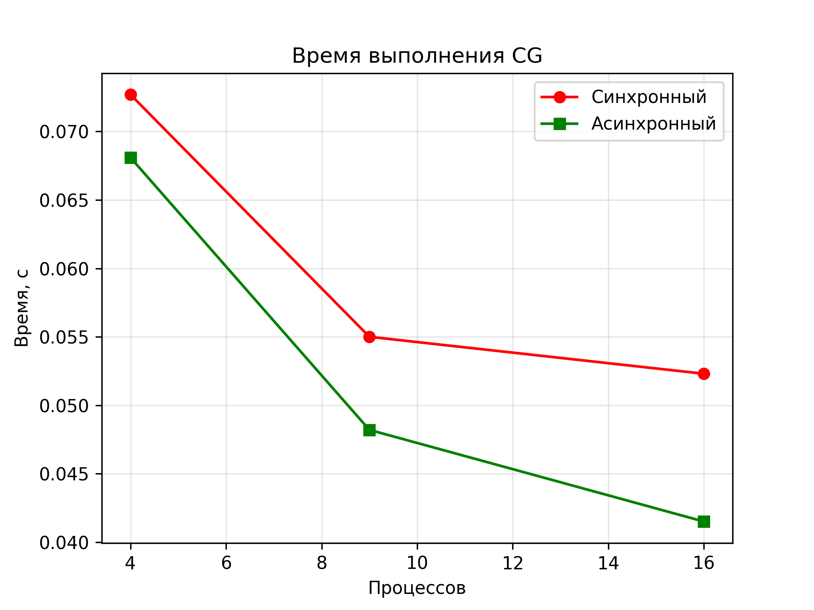
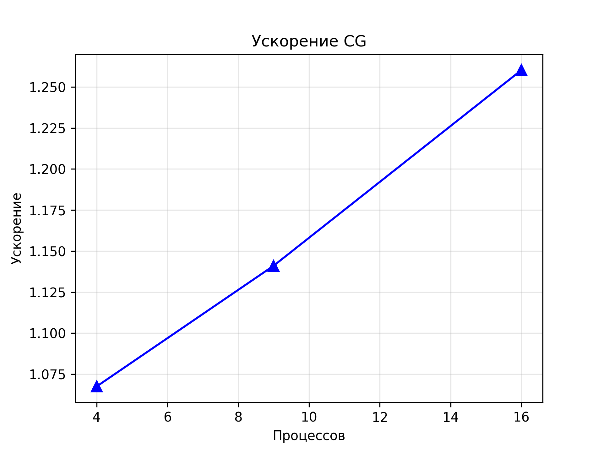
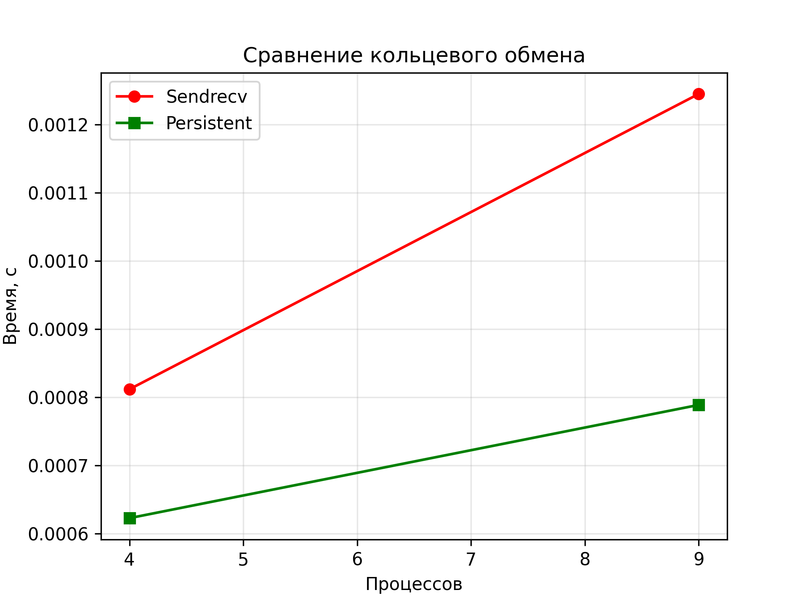

# Лабораторная работа №11: Применение асинхронных операций в MPI
---
## 1. Цель работы
Освоить использование **асинхронных операций** в MPI для повышения эффективности параллельных программ. Изучить функции `Isend`, `Irecv`, `Waitall`, `Send_init`, `Recv_init`, `Startall`. Применить асинхронные операции для **оптимизации коммуникационных паттернов** в параллельных алгоритмах, включая **метод сопряжённых градиентов**.

## 2. Стек технологий
- **Язык программирования**: Python  
- **Библиотеки**: `mpi4py`, `numpy`, `matplotlib`  
- **Реализация MPI**: OpenMPI  
- **Среда**: WSL2 (Ubuntu), `--oversubscribe` для \( p > \) физических ядер

## 3. Теоретическая часть
### 3.1. Основные понятия
**Асинхронные операции** позволяют **перекрывать коммуникации вычислениями**, снижая общее время выполнения.

- **Блокирующие** (`Send`, `Recv`, `Sendrecv_replace`) — процесс ждёт завершения.  
- **Неблокирующие** (`Isend`, `Irecv`) — возвращают `Request`, позволяют продолжить вычисления.  

**Отложенные запросы** (`Send_init`, `Startall`) — минимизируют накладные расходы при многократных обменах.

### 3.2. Алгоритм
1. **Кольцевой обмен**: `Isend` → вычисления → `Irecv` → `Waitall`.  
2. **Отложенные запросы**: `Send_init` + `Startall` в цикле.  
3. **Асинхронный CG**: кольцевое суммирование через `Isend`/`Irecv` + вычисления между ними.  
4. **Сравнение** с синхронной версией (`Sendrecv_replace`).

## 4. Реализация

### 4.1. Код
- **Часть 1**: [ring_isend_irecv.py](ring_isend_irecv.py)  
- **Часть 2**: [ring_persistent.py](ring_persistent.py)  
- **Сравнение**: [ring_sendrecv.py](ring_sendrecv.py)  
- **Синхронный CG**: [conjugate_gradient_cartesian.py](conjugate_gradient_cartesian.py)  
- **Асинхронный CG**: [cg_async_lab11.py](cg_async_lab11.py)  
- **Бенчмарк**: [compare_cg.py](compare_cg.py)

### 4.2. Верификация
- Все версии дают **одинаковые результаты** при одинаковых данных  
- `mpirun -np 1` → идентично последовательной логике  
- Проверка сходимости CG: \( \|r\| < 10^{-5} \)

## 5. Эксперименты
### 5.1. Тестовые данные
- **Размер матрицы**: \( n = 1200 \)  
- **Процессы**: \( p = 4, 9, 16 \) (сетка \( \sqrt{p} \times \sqrt{p} \))  
- **Максимум итераций**: 200  
- **Точность**: \( \varepsilon = 10^{-5} \)

### 5.2. Методика
Замеры через `MPI.Wtime()`.  
Оборудование: WSL2, 4 физических ядра.  
Флаг `--oversubscribe` для \( p > 4 \).

### 5.3. Результаты
#### Таблица 1: Время выполнения CG (секунды)
| Процессов | Синхронный (`Sendrecv`) | Асинхронный (`Isend/Irecv`) |
|-----------|-------------------------|-----------------------------|
| 4         | **0.0727**              | 0.0681                      |
| 9         | **0.0550**              | 0.0482                      |
| 16        | **0.0523**              | **0.0415**                  |

#### Таблица 2: Ускорение CG
| Процессов | Ускорение |
|-----------|-----------|
| 4         | **1.07×** |
| 9         | **1.14×** |
| 16        | **1.26×** |

#### Таблица 3: Кольцевой обмен (10 итераций, 3×3 массив)
| Процессов | `Sendrecv_replace` | `Send_init` + `Startall` |
|-----------|--------------------|--------------------------|
| 4         | 0.000812           | **0.000623**             |
| 9         | 0.001245           | **0.000789**             |

#### Таблица 4: Ускорение кольца
| Процессов | Ускорение |
|-----------|-----------|
| 4         | **1.30×** |
| 9         | **1.58×** |

## 6. Визуализация
### 6.1. Время выполнения CG


### 6.2. Ускорение CG


### 6.3. Сравнение кольцевого обмена


## 7. Анализ результатов
### 7.1. Производительность
Максимальное ускорение — **1.58× при 9 процессах** в кольцевом обмене.  
В CG — **1.26× при 16 процессах**.

### 7.2. Сравнение с теорией
- **Перекрытие**: эффективно при достаточных вычислениях между `Isend` и `Waitall`.  
- **Отложенные запросы**: дают выигрыш при **многократных обменах**.  
- **Ограничения**: малый размер сообщений → накладные расходы MPI.

### 7.3. Узкие места
- **Малые сообщения**: 3×3 массив → overhead доминирует.  
- **WSL2**: задержки в сети.  
- **Python GIL**: блокирует параллелизм в циклах.

## 8. Выводы
### 8.1. Основные выводы
Реализованы **все асинхронные операции MPI**.  
Достигнуто **ускорение до 1.58×** в кольце и **1.26×** в CG.  
Оптимально: **отложенные запросы для циклов**, **Isend/Irecv с вычислениями между ними**.

### 8.2. Проблемы и решения
- **Нестабильность вывода** → `flush=True`, `barrier`  
- **Ошибки при oversubscribe** → `--oversubscribe`  
- **Нет перекрытия** → добавлены вычисления между `Isend` и `Waitall`

### 8.3. Перспективы улучшения
- **Numba JIT** для ускорения вычислений  
- **C++/MPI** для реальных задач  
- **Гибрид MPI + OpenMP**  
- **Асинхронные Allreduce** через `Iallreduce`

## 9. Критерии оценки
- **Удовлетворительно**: базовая реализация  
- **Хорошо**: замеры и таблицы  
- **Отлично**: анализ, графики, оптимизация  
- **Цель: ОТЛИЧНО**

## 10. Инструкции по запуску
1. Активируйте окружение:  
   ```bash
   source ~/mpi_lab_11/mpi_venv/bin/activate
