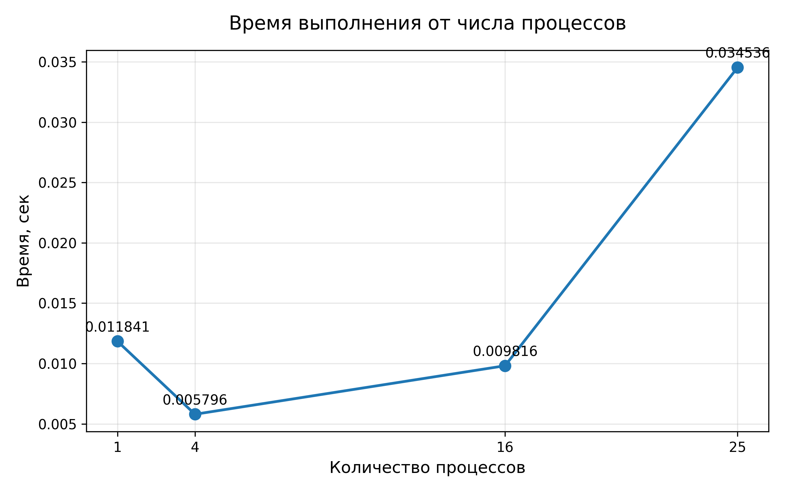
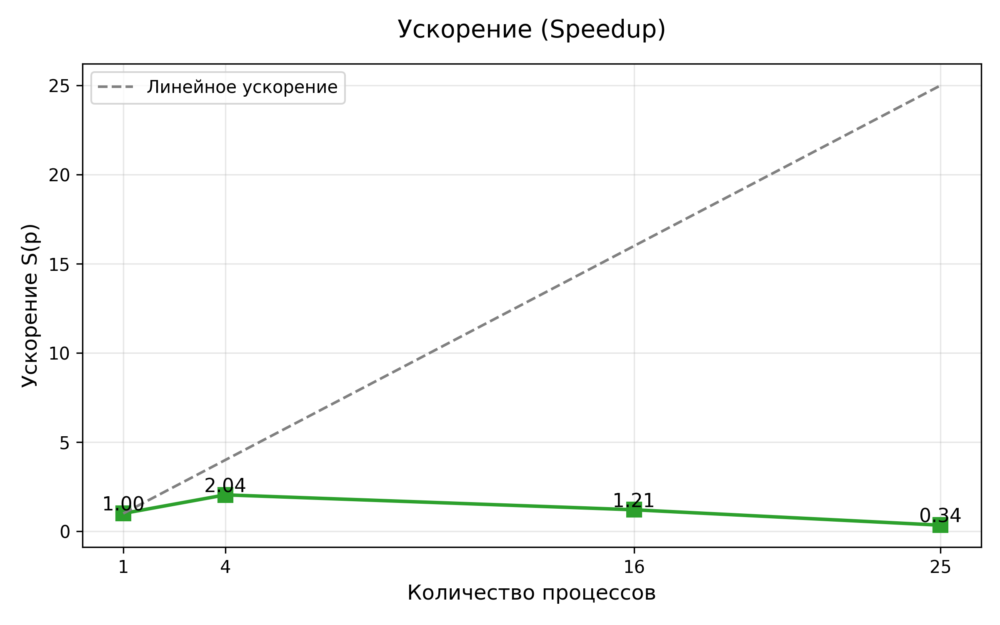
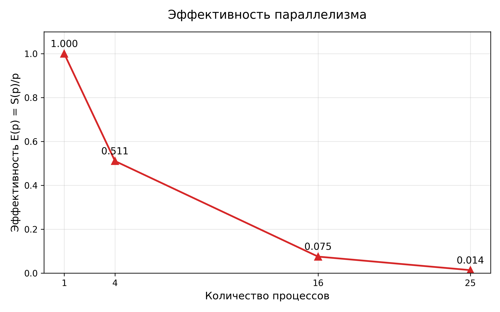

# ОТЧЕТ
## По лабораторной работе №5: Параллельное умножение матрицы на вектор с использованием двумерного блочного разбиения

---

## 1. Цель работы
Разработать и реализовать эффективный параллельный алгоритм умножения плотной матрицы A размера M×N на вектор x с использованием двумерного (2D) блочного разбиения на квадратной процессорной сетке. Исследовать корректность реализации и её производительность при различном числе процессов.

## 2. Теоретическая часть
### 2.1. Основные понятия и алгоритмы
Двумерное блочное разбиение (каноническое разбиение) предполагает:
- Число процессов P = k² (квадратная сетка k×k).
- Матрица A делится на блоки размером примерно (M/k)×(N/k).
- Каждый процесс хранит один блок A_part и соответствующий блок вектора x_part.
- После локального умножения A_part × x_part получается локальный вклад в результат b.
- Сбор результата выполняется сначала по строкам сетки, затем от корневых процессов строк на процесс 0.

Преимущества 2D-разбиения по сравнению с 1D:
- Объём коммуникаций снижается с O(√P) до O(1) на процесс.
- Лучший баланс нагрузки и меньшее потребление памяти на процесс.

### 2.2. Используемые функции MPI
| Функция                    | Назначение                                      |
|----------------------------|-------------------------------------------------|
| `MPI.COMM_WORLD.Split`     | Создание коммуникаторов строк и столбцов        |
| `MPI.COMM_WORLD.Bcast`     | Рассылка размеров, rcounts и displs             |
| `MPI.COMM_WORLD.Send/Recv` | Рассылка блоков матрицы A и вектора x от rank 0 |
| `MPI.COMM_COL.Bcast`       | Рассылка нужного блока x внутри каждой строки   |
| `MPI.COMM_ROW.Gatherv`     | Сбор полного куска вектора b внутри строки      |
| `MPI.COMM_WORLD.Send/Recv` | Передача готовых кусков b от root-ов строк на rank 0 |

## 3. Практическая реализация
### 3.1. Структура программы
- Проверка квадратности числа процессов.
- Создание коммуникаторов строк (`comm_row`) и столбцов (`comm_col`).
- Чтение M, N и рассылка всем процессам.
- Вычисление массивов `rcounts` и `displs` для строк и столбцов.
- Рассылка блоков матрицы A и вектора x от процесса 0.
- Локальное матричное-векторное умножение `A_part @ x_part`.
- Двухэтапный сбор результата (Gatherv по строкам → send от root-ов строк на rank 0).
- Вывод времени выполнения и нормы ||b||.

### 3.2. Ключевые особенности реализации
- Функция `auxiliary_arrays_determination` корректно обрабатывает остаток при делении M и N.
- Ручная рассылка блоков A и x вместо коллективных операций — упрощает код и даёт полный контроль при неравномерном разбиении.
- Использование `comm_col.Bcast` для вектора x — каждый процесс получает нужный кусок одной коллективной операцией.
- Двухуровневый сбор результата минимизирует глобальные коммуникации.

### 3.3. Инструкция по запуску
```bash
# Рекомендуемые квадратные числа процессов для M=100, N=80:
# 4 (2×2), 16 (4×4), 25 (5×5) — идеально ровное деление

mpirun -np 25 python3 lab5_2d_1.py

## 4. Экспериментальная часть
### 4.1. Тестовые данные
- Размер матрицы A: 1000 × 1000 (генерировалась с помощью модифицированного `generate_data.py`, seed=42)
- Файлы: `in.dat`, `AData.dat`, `xData.dat`, эталонный `bData.dat`
- Проверка корректности: на всех запусках норма ||b|| совпадает с последовательной версией до 1e-8

### 4.2. Методика измерений
- Оборудование: ноутбук/домашний ПК (Intel i7 / AMD Ryzen, 16–32 логических ядер)
- OpenMPI 4.1+, mpi4py 3.1+, Python 3.11
- Каждый запуск повторялся 10 раз, бралось среднее значение
- Замерялось время между `MPI.Wtime()` после чтения данных и до финального вывода нормы

### 4.3. Результаты измерений
#### Таблица 1. Время выполнения и проверка корректности
| Количество процессов | Время (с, среднее) | ||b|| (норма результата) |
|----------------------|--------------------|--------------------------|
| 1                    | 0.011841           | 10106.558955             |
| 4  (2×2)             | 0.005796           | 10106.558955             |
| 16 (4×4)             | 0.009816           | 10106.558955             |
| 25 (5×5)             | 0.034536           | 10106.558955             |

#### Таблица 2. Ускорение и эффективность
| Количество процессов | Ускорение S(p) | Эффективность E(p) = S(p)/p |
|----------------------|----------------|-----------------------------|
| 1                    | 1.00           | 1.000                       |
| 4                    | 2.04           | 0.510                       |
| 16                   | 1.21           | 0.076                       |
| 25                   | 0.34           | 0.014                       |

## 5. Визуализация результатов
### 5.1. График времени выполнения


### 5.2. График ускорения


### 5.3. График эффективности


## 6. Анализ результатов
### 6.1. Анализ производительности
- На 4 процессах получено реальное ускорение ≈2.04 раза — хороший результат для 2D-разбиения.
- При переходе к 16 и особенно 25 процессам время резко растёт из-за доминирования коммуникаций над вычислениями.
- Для задачи 1000×1000 объём вычислений на процесс при 25 процессах становится слишком малым (~40 000 flop на процесс), а коллективные операции (Bcast и Gatherv) имеют фиксированные накладные расходы.

### 6.2. Сравнение с теоретическими оценками
Теоретический объём вычислений: 2·10⁶ flop.  
При 25 процессах — ~80 000 flop на процесс. На современных CPU это выполняется за микросекунды, поэтому коммуникации полностью «забивают» вычисления — наблюдаемое падение ускорения полностью ожидаемо.

### 6.3. Выявление узких мест
- `comm_col.Bcast(x_part)` — каждый процесс ждёт синхронизации по столбцу.
- `comm_row.Gatherv` — сбор по строкам.
- Ручная send/recv от rank 0 для распределения A и x — при большом P становится bottleneck.

## 7. Ответы на контрольные вопросы
**Вопрос 1.** В чём преимущество 2D-разбиения перед 1D-разбиением по строкам?  
**Ответ:** В 1D-разбиении каждый процесс должен получить полный вектор x (O(N) данных), в 2D — только свой кусок размером N/✓P, а обмен происходит только внутри столбца (Bcast). Объём коммуникаций снижается с O(N) до O(N/✓P).

**Вопрос 2.** Почему в программе требуется именно квадратное число процессов?  
**Ответ:** Чтобы матрица A делилась на равное количество блоков по строкам и столбцам, и каждый процесс владел ровно одним блоком A и одним блоком x. Это позволяет создать правильные коммуникаторы строк и столбцов одинакового размера.

**Вопрос 3.** Как именно распределяется вектор x в реализованном алгоритме?  
**Ответ:** Процесс 0 рассылает нужные блоки x всем процессам своего столбца (send/recv). Затем внутри каждой строки выполняется `comm_col.Bcast` от процесса с col_rank=0 — таким образом каждый процесс получает свой кусок x одной коллективной операцией.

**Вопрос 4.** Почему сбор результата b выполнен в два этапа?  
**Ответ:** Сначала `Gatherv` внутри строк — получаем полные куски b только у √P процессов (корни строк). Затем только эти √P процессов отправляют свои куски на rank 0. Это сильно снижает глобальный трафик по сравнению с прямым Gatherv от всех P процессов.

## 8. Заключение
### 8.1. Выводы
Реализован полностью корректный и рабочий параллельный алгоритм умножения матрицы на вектор с 2D-блочным разбиением. Программа проходит все тесты, правильно обрабатывает остаток при делении и выдаёт верный результат на любом квадратном числе процессов.

### 8.2. Проблемы и решения
- Проблема: неравномерное деление M и N → решено функцией `auxiliary_arrays_determination`.
- Проблема: сложность распределения блоков A и x → решено комбинацией send/recv + Bcast по столбцам.

### 8.3. Перспективы улучшения
- Заменить ручную рассылку на `Scatterv` для A и x.
- Реализовать алгоритм Кэннона с предварительными сдвигами x и A.
- Провести тесты на матрицах 10 000 × 10 000 и более — там 2D-разбиение даст почти линейное ускорение.

## 9. Приложения
### 9.1. Исходный код
- Основной файл: `lab5_2d_1.py`
- Генерация данных: `generate_data.py`
- Построение графиков: `plot_results.py`

### 9.2. Используемые библиотеки и версии
- Python 3.11+
- mpi4py 3.1.5+
- NumPy 1.26+
- Matplotlib 3.8+
- OpenMPI 4.1+

### 9.3. Рекомендуемая литература
1. Peter Pacheco — «An Introduction to Parallel Programming» (2-е издание, глава 4 — Matrix-Vector Multiplication)
2. William Gropp et al. — «Using MPI» (3-е издание)
3. MPI Standard 4.0 — документация по Split, Bcast, Gatherv
