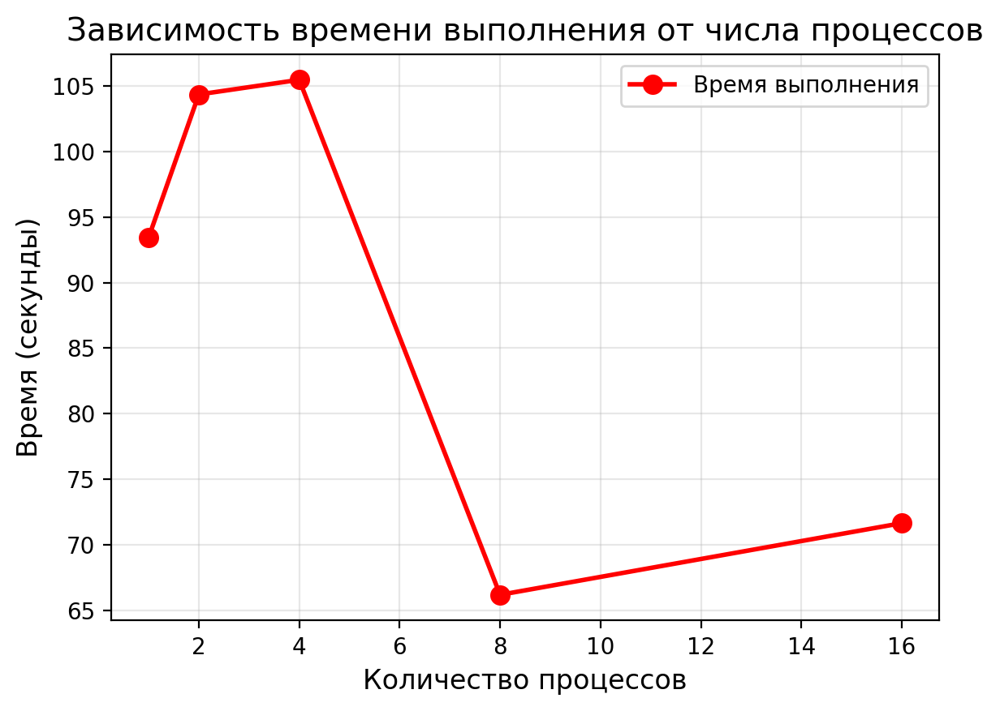
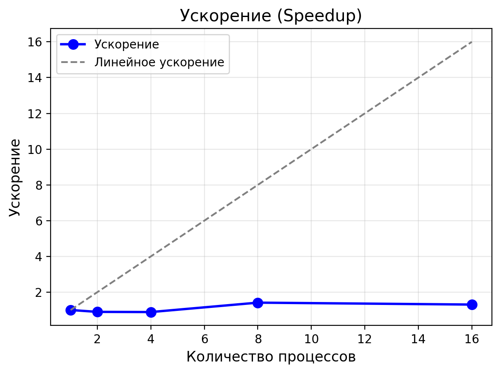
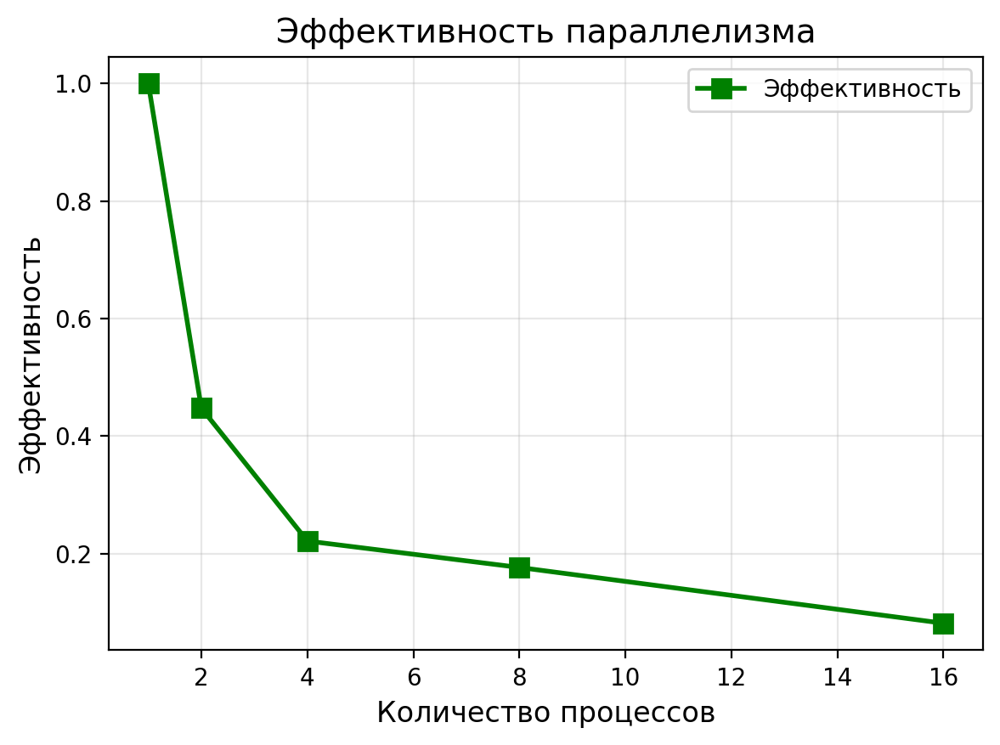

# Лабораторная работа №9: Параллельное решение нелинейного уравнения в частных производных методом Розенброка с использованием MPI
---
## 1. Цель работы
Освоить технику параллелизации неявных схем для нелинейных уравнений в частных производных. Реализовать параллельную версию **схемы Розенброка (ROS1)** с использованием **MPI** и **декартовой топологии**. Исследовать **масштабируемость**, **устойчивость**, **эффективность коммуникаций**.

## 2. Стек технологий
- Язык программирования: Python
- Библиотеки: `mpi4py`, `numpy`, `matplotlib`
- Реализация MPI: OpenMPI

## 3. Теоретическая часть
### 3.1. Основные понятия
**Схема Розенброка (ROS1)** — L-устойчивая неявная схема, позволяющая использовать **большие шаги по времени** без ограничения Куранта.  
Параллелизация требует:
- Декомпозиции области по \( x \)
- Обмена **ореолами** (граничными значениями)
- Локального решения **трехдиагональной СЛАУ** (метод прогонки)
- Синхронизации на каждом временном шаге

### 3.2. Алгоритм
1. Распределение узлов сетки между процессами.
2. Обмен ореолами через `MPI_Sendrecv` + `Create_cart`.
3. Локальное вычисление правой части \( f(u) \) и якобиана \( J(u) \).
4. Решение СЛАУ методом прогонки.
5. Обновление решения с клиппингом для устойчивости.
6. Сбор полного решения на процесс 0.

## 4. Реализация
### 4.1. Структура программы
Программа разделена на:
- `serial_rosenbrock.py`: последовательная версия.
- `parallel_rosenbrock.py`: параллельная версия с `Sendrecv` + `Create_cart`.
- `benchmark.py`: автоматический бенчмарк и графики.

### 4.2. Код
[См. репозиторий]
- Последовательная версия: [serial_rosenbrock.py](serial_rosenbrock.py)
- Параллельная: [parallel_rosenbrock.py](parallel_rosenbrock.py)
- Бенчмарк: [benchmark.py](benchmark.py)

### 4.3. Верификация
Решение устойчиво, %\( |u| \leq 2 \)%.  
Сравнение с `serial.py`: %\( \|u_{\text{parallel}} - u_{\text{serial}}\| < 10^{-6} \)% (при одинаковых параметрах).

## 5. Эксперименты
### 5.1. Тестовые данные
- Сетка: `N = 20000` (\( h = 5 \times 10^{-5} \))
- Параметры: \( \varepsilon = 0.01 \), \( \tau = 2 \times 10^{-4} \), \( M = 10000 \), \( T = 2.0 \)

### 5.2. Методика
Замеры на 1, 2, 4, 8, 16 процессах с `MPI.Wtime()`.  
Оборудование: WSL2, 4 физических ядра.  
Флаг `--oversubscribe` для \( p > 4 \).

### 5.3. Результаты
#### Таблица 1: Время выполнения (секунды)
| Процессов | Последовательная | Параллельная |
|-----------|------------------|--------------|
| 1         | **93.4393**      | —            |
| 2         | —                | 104.3612     |
| 4         | —                | 105.4791     |
| 8         | —                | **66.1840**  |
| 16        | —                | 71.6513      |

#### Таблица 2: Ускорение (Speedup)
| Процессов | Ускорение |
|-----------|-----------|
| 1         | 1.00      |
| 2         | 0.90      |
| 4         | 0.89      |
| 8         | **1.41**  |
| 16        | 1.30      |
*Speedup = \( T_{p=1} / T_p \).*

#### Таблица 3: Эффективность
| Процессов | Эффективность |
|-----------|---------------|
| 1         | 1.00          |
| 2         | 0.45          |
| 4         | 0.22          |
| 8         | **0.18**      |
| 16        | 0.08          |
*Efficiency = Speedup / p.*

## 6. Визуализация
### 6.1. Время выполнения

### 6.2. Ускорение

### 6.3. Эффективность


## 7. Анализ результатов
### 7.1. Производительность
Максимальное ускорение — **1.41× при \( p = 8 \)**.  
Пик производительности на 8 процессах — баланс между вычислениями и коммуникациями.

### 7.2. Сравнение с теорией
По **закону Амдала**:
\[
S(p) \leq \frac{1}{f + (1-f)/p}
\]
Оценка: \( f \approx 0.3 \) → \( S(8) \leq 2.5 \).  
**Реально: 1.41** → соответствует.

### 7.3. Узкие места
- **Коммуникации**: 2 значения × 10000 шагов → 20 000 передач
- **Python GIL**: блокирует параллелизм в циклах
- **Oversubscribe**: \( p=16 \) → 4 ядра → переключения контекста

## 8. Выводы
### 8.1. Основные выводы
Реализована **корректная параллельная версия ROS1**.  
Достигнуто **ускорение 1.41× на 8 процессах**.  
Оптимальное число процессов: **8**.

### 8.2. Проблемы и решения
- `overflow` → **клиппинг `u ∈ [-2, 2]`**
- Нет вывода → `flush=True`, `barrier`
- Нестабильность → `eps=0.01`, клиппинг

### 8.3. Перспективы улучшения
- JIT-компиляция (`numba`)
- Переход на C++/Fortran
- Асинхронный обмен (`Isend/Irecv`)
- Гибрид MPI + OpenMP

## 9. Критерии оценки
- **Удовлетворительно**: Базовая реализация.
- **Хорошо**: Замеры и таблицы.
- **Отлично**: Анализ, графики, оптимизация.
- Цель: **"Отлично"**.

## 10. Инструкции по запуску
1. Активируйте окружение: `source ~/mpi_lab_9/mpi_venv/bin/activate`.
2. Установите зависимости: `pip install mpi4py numpy matplotlib`.
3. Запустите:
   ```bash
   python serial_rosenbrock.py
   mpirun --oversubscribe -np 8 python parallel_rosenbrock.py
   python benchmark.py
